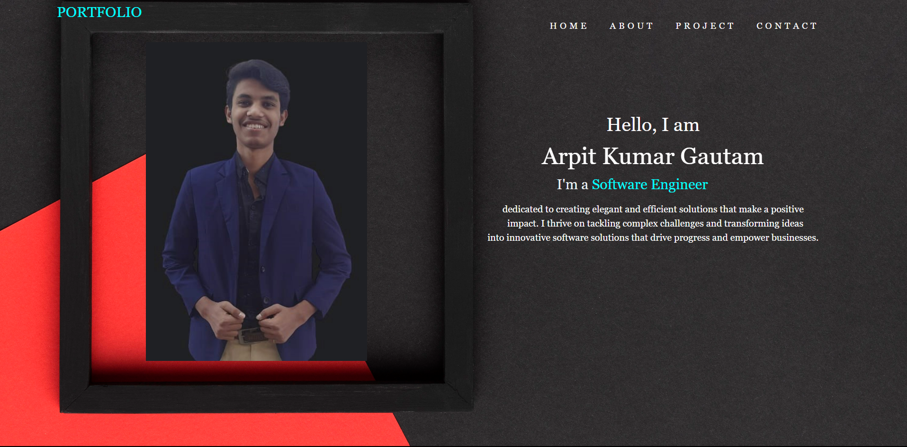

# Port_Folio
<h1 align="center">This is my Port Folio Website</h1>

Welcome to my portfolio website! This website showcases my projects, skills, and experiance in the field of software engineering . It serves as an interactive resume and a platform to highlight my word.

<h3><b>Live Demo</b></h3>

 you can access the live versionof my portfolio website at 

<h3><b>Features</b></h3>
<ul>
  <li><b>Skills:</b> Explore the key skills I possess and the technologirs I'm proficient in</li>
  <li><b>Experience:</b>Learn about my professional experiance and previous work engagements</li>
  <li><b>Contact: </b>Get in touch with me using the provided contact form or through my social media profiles</li>
</ul>

<h3>Technology used</h3>
<ul>
  <li><b>HTML</b></li>
  <li><b>CSS</b></li>
</ul>

Feel free to reach out to me if you have any questions or inquiries   Thank you for visiting my portfolio website

